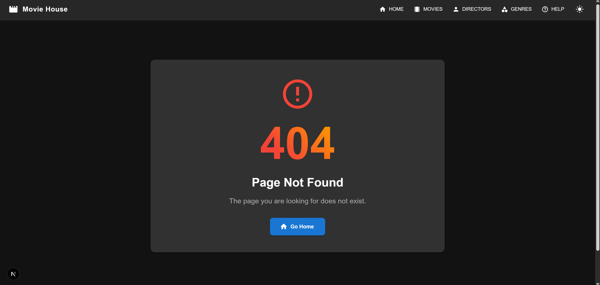

# Advanced Programming Assignment 3
## Movie House - Next.js Movie Directory

A movie directory application built with Next.js demonstrating various rendering patterns and routing strategies.

## UI Library

The application uses Material UI (v7.1.0) to create a modern, responsive, and accessible user interface with the following features:

- **Responsive Layout**: Adapts to different screen sizes for optimal viewing experience
- **Theme Customization**: Supports light and dark mode with a custom theme configuration
- **Component System**: Utilizes Material UI components throughout the application:
  - Cards for displaying movies and directors
  - AppBar and navigation with icons
  - Typography system for consistent text styling
  - Rating component for movie ratings
  - Grid and Container for layout organization
  - Custom styling with the sx prop for component customization
- **Material Icons**: Uses Material icons for enhanced visual cues and navigation
- **Consistent Styling**: Maintains a cohesive design language across all pages

## Dark Mode Implementation

The application features a comprehensive dark mode that enhances user experience and reduces eye strain in low-light environments:

### Technical Implementation

- **Context API**: Uses React's Context API to manage theme state across the entire application
- **Custom Theme Provider**: Created a custom `ThemeContext` provider that wraps the application
- **Persistent Preferences**: Theme preference is saved to localStorage to persist between sessions
- **SSR Compatibility**: Handles server-side rendering gracefully by checking if localStorage is available
- **Integration with Material UI**: The custom theme context works seamlessly with Material UI's ThemeProvider

### Theme Switching

- **Toggle Button**: Implemented in the app header with intuitive icons (DarkModeIcon/LightModeIcon)
- **Real-time Updates**: Theme changes are applied instantly without page reload
- **Visual Feedback**: Tooltip provides user guidance for the theme toggle functionality

### Styling Adaptations

- **Color Palette Adjustments**: Different color schemes for light and dark modes
  - Light mode: Clean white backgrounds with blue accents
  - Dark mode: Dark gray backgrounds (#121212, #1e1e1e) with adjusted contrast
- **Component-specific Styling**: Custom component styles based on current theme
  - Cards with appropriate shadows and hover effects
  - Text colors optimized for readability in both modes
  - AppBar with theme-specific background colors
- **Visual Hierarchy**: Maintained across both themes for consistent user experience

## Pages and Features

### Home Page (`/index.js`)
- Displays trending movies section
- Browse Genres button for navigation
- Uses `getStaticProps()` with ISR (revalidate: 3600)
- Shows 404 when data not found
- Implements Material UI's Typography, Grid, and Box components for clean layout


### Movies Page (`/movies`)
- Lists all movies in card format
- Genre-based filtering via select input
- Links to individual movie pages
- Implements ISR with `getStaticProps()`
- 404 handling for missing data
- Uses Material UI Cards, Grid system, and theme styling for consistent UI
- Custom Card components with hover effects and responsive design


### Movie Details (`/movies/[id]`)
- Complete movie information:
  - Title
  - Description  
  - Director (with link to director page)
  - Release Year
  - Rating
- Uses `getStaticPaths` and `getStaticProps`
- Implements fallback pages for on-demand generation
- Used ISR since we are using ISR for /movies, therefore there is the assumption that movies details can be updated, thus ISR also seems valid for movie details page
- Enhanced with Material UI icons for visual cues (LocalMoviesIcon, DirectorChairIcon, CalendarTodayIcon, StarIcon)
- Rating component for visual display of movie ratings


### Movie Director Page (`/movies/[id]/director`) 
- Detailed director information of a specific movie
  - Director Name
  - Director Biography
  - Other Movies by this Director
- SSG since /movies and /movies/[id] are also SSG and this will also load up the page since there is minimal user interactivity on this page
- ISR because details of movies can be updated which can include director (incase wrong director was selected in the data first time)
- Utilizes Material UI's Card, Typography, Box, and Divider components
- PersonIcon for enhancing visual presentation


### Help Section (`/help/[...slug]`)
Catch-all routes for help pages:
- `/help/faqs`  
- `/help/contact`
- `/help/privacy`
- Styled with Material UI's Paper, Typography, and Breadcrumbs components
- Enhanced with Material Icons (HelpOutlineIcon, NavigateNextIcon, ArrowBackIcon)


### Help Section Index route (`/help/index.js`)
Since /help/[...slug] can't catch /help, therefore created this file to catch /help, another solution was [[...slug]]
- Implements Material UI Card, Typography, and Grid layout
- Icon-based navigation (HelpOutlineIcon, InfoIcon, HomeIcon, MovieIcon, PeopleIcon, CategoryIcon)


### Custom 404 Page
- User-friendly error message
- "Go Home" navigation button
- Styled with Material UI's Container, Paper, Typography, and Box components
- ErrorOutlineIcon and HomeIcon for enhanced visual presentation


### Genres Page (`/genres`)
- Server-side rendered with `getServerSideProps()`
- Lists genres with movie counts
- Links to genre-specific pages
- Implements Material UI's Card, Chip, Typography, and Container components
- LocalMoviesIcon for genre cards


### Genre Details (`/genres/[id]`)
- Server-side rendered filtered movie list
- Shows all movies in selected genre
- Styled with Material UI Grid system and ArrowBackIcon for navigation
- Responsive layout with consistent card styling


### Directors Page (`/directors/index.js`)
- Client-side rendered using `useSWR`
- for SWR, needed an api , so created api route `/api/directors`
- Displays Card for each director
- Each card links to details page of director
- Each card Displays:
  - Director name
  - Biography
  - Count of Movies directed
- Material UI implementation with Card, CardContent, Typography, and Grid
- PersonIcon and MovieIcon for visual enhancement
- Responsive design with theme-aware styling


### Director Details Page (`/directors/[id].js`)
- Client-side rendered using `useSWR`
- for SWR, needed an api , so used api route `/api/directors`
- Displays:
  - Name
  - Biography
  - Movies Cards
- Styled with Material UI Paper, Typography, and Grid components
- PersonIcon for visual presentation
- Consistent theming with the rest of the application


## Database Implementation

The application uses a MySQL database to store and manage movie data, implemented with the following approach:

### Database Setup and Configuration

- **Local MySQL Database**: Utilizes a local MySQL instance managed with DBngin
- **Environment Variables**: Database connection details stored in `.env.local`:
  ```
  MYSQL_HOST=localhost  
  MYSQL_PORT=3306  
  MYSQL_DATABASE=movie_house  
  MYSQL_USER=root  
  MYSQL_PASSWORD= 
  ```
- **Connection Pool**: Uses mysql2 with a connection pool to efficiently manage database connections
- **Database Structure**: Three main tables with relationships:
  - `movies` - Stores movie information with foreign keys to directors and genres
  - `directors` - Contains director details and biographies
  - `genres` - Maintains list of movie genres

### Database Utility Functions

The application uses a dedicated `utils/db.js` module that provides:

- **Query Abstraction**: Simplified function for querying db for data
  - `query()` - Execute raw SQL queries with parameters
- **Connection Management**: Proper handling of database connections and error states
- **Parameterized Queries**: Protection against SQL injection by using parameterized queries

### Data Initialization

- **Database Seeding**: Initial data loaded through `/api/load-data` endpoint
- **Schema Creation**: Tables automatically created with proper foreign key constraints
- **Sample Data**: Pre-populated with sample movies, directors, and genres for testing

## API Routes

The application implements a comprehensive set of API endpoints following RESTful principles:

### Movie APIs

- **`/api/movies`** - Get all movies with optional filtering
- **`/api/movies/[id]`** - Get detailed information about a specific movie
- **`/api/movies/get-trending`** - Retrieve top-rated movies (used on homepage)
- **`/api/movies/[id]/director`** - Get director information for a specific movie

### Director APIs

- **`/api/directors`** - List all directors with movie counts
- **`/api/directors/[id]`** - Get director details with their complete filmography

### Genre APIs

- **`/api/genres`** - Get all available genres
- **`/api/genres/[id]/movies`** - Get all movies in a specific genre

### Database Management

- **`/api/load-data`** - Initialize database tables and seed with sample data

### API Implementation Pattern

- **Error Handling**: Consistent error response format across all endpoints
- **HTTP Methods**: Proper use of HTTP methods (GET for retrieving data)
- **Status Codes**: Appropriate HTTP status codes (200, 404, 500, etc.)
- **Query Parameters**: Support for filtering and pagination where appropriate
- **Response Format**: Structured JSON responses with consistent schemas